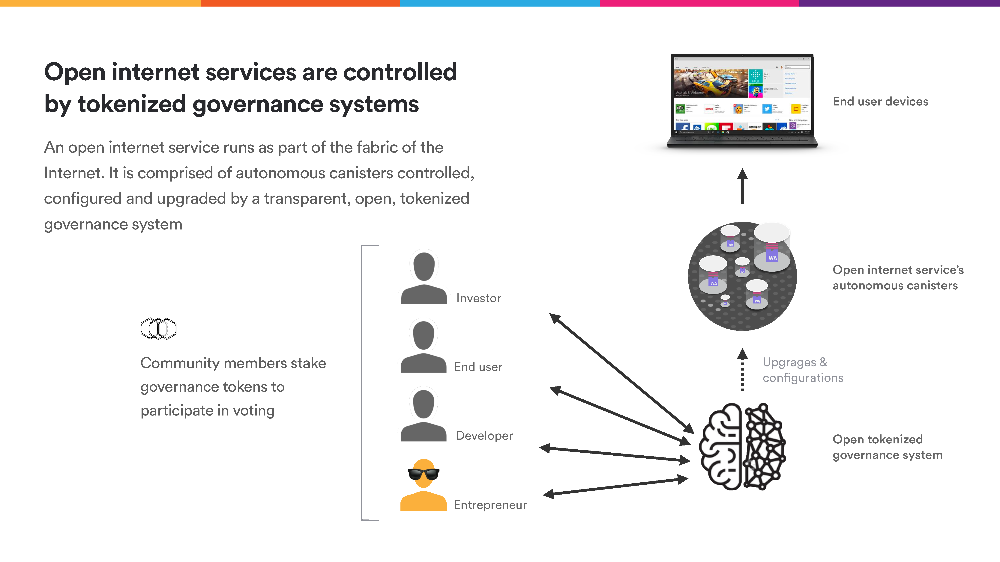
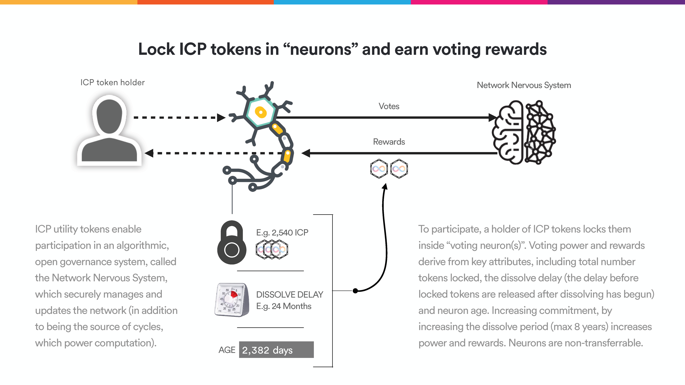
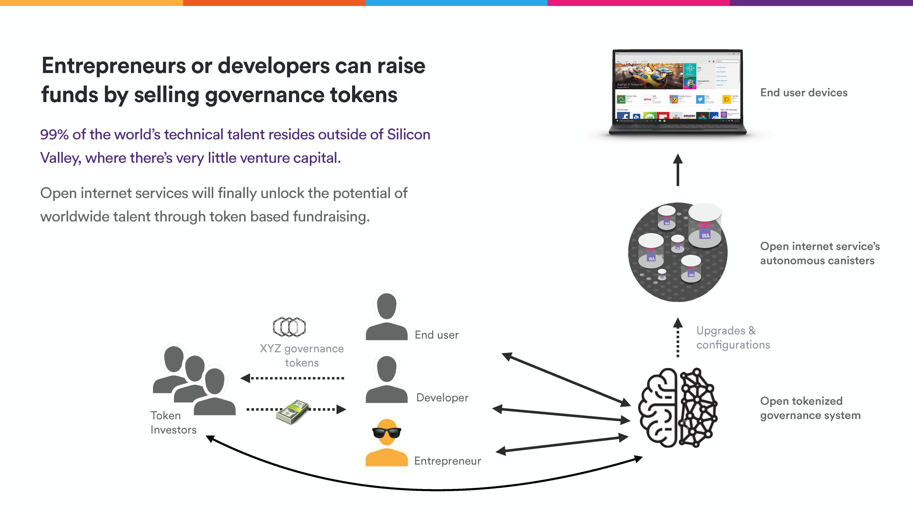

# Module 1 - Intro to Open Governance Models

This module introduces the concept of open governance on the IC, using the Network Nervous System (NNS) as an example, and outlines how tokenized governance systems unlock "Open Internet Services" and corresponding new business models on the IC. 

## Outline

1. What is an Open Governance Model?
2. The NNS & Open Governance on the IC
3. Open Internet Services

## What is an Open Governance Model?

Let's begin with examples of some *closed* governance models - systems in which there is a central authority, typically a private company or organization, that makes decisions behind a closed door with little to no stakeholder input. Public companies allow individuals to purchase partial ownership in the form of stock, but these shares offer few voting rights for the average person purchasing small quantities of shares.

Now, let's imagine a system in which *every* token-holding stakeholder has the right to vote on changes to the network. In this case, a **token** is just a digital unit of value that can be granted special permissions such as voting rights (see our [Blockchain and Cryptocurrency](https://github.com/DFINITY-Education/blockchain-and-cryptocurrency) course for more information regarding token creation on the IC). In such a system, there's no central authority - all changes to the network, no matter how large or small, require stakeholder approval and are publicly displayed. This enables an unprecedented level of transparency and democratization of governance.

 

 <i> An open internet service in which token-holders can vote on proposals modifying the service's underlying autonomous canisters. </i>

## The NNS & Open Governance on the IC

In his [Internet Computer Roadmap](https://medium.com/dfinity/announcing-internet-computer-mainnet-and-a-20-year-roadmap-790e56cbe04a) post, Dominic Williams, Founder and Chief Scientist at DFINITY, outlines the complexities of creating an open governance system with blockchain technology:

> Governance has always been a thorny issue for blockchain. On the one hand, networks must truly be decentralized in order to not be controlled by any particular actors, whether affiliated persons or organizations, because if they were so controlled, the controllers could be petitioned to close them down, or the controller could become corrupt and subvert the guarantees of security provided by the networks to hosted tokens and code. On the other hand, some control should be exerted from somewhere, because such networks are formed by complex technology that must inevitably be fixed, refined and upgraded in production, and as they become more powerful — as the Internet Computer has become — the possibility that malign actors apply them in nefarious schemes with grave impacts increases. Regarding this latter point, a fair argument is that all technology can be misapplied — a smartphone can be used by a terrorist to detonate an IED, for example. Nonetheless, this does not absolve all considerations.

The Internet Computer implements an intelligent open governance model via the **Network Nervous System** (NNS). The NNS is an autonomous governance system that allows users to submit proposals that can modify any aspect of the IC network. Stakeholders create **neurons** that vote to accept or reject each proposal. Neurons are created by "locking" ICP tokens for a set duration of time, which prevents these tokens from being transferred or converted to cycles. ICP tokens serve three primary purposes:

1. **Facilitate stakeholder participation** in network governance (i.e. grant proportional voting rights)
2. **Reward participants** that consistently vote on proposals or operate node machines
3. **Conversion to cycles** for use in powering computation on the IC

 

 <i> The process through which ICP token holders lock their tokens inside "neurons" to participate in network voting. </i>

At a high level, a neuron's voting power on this IC is proportional to the amount the ICP locked up, the age of the neuron, and the lockup period remaining (called the **dissolve delay**). This incentivizes neuron-holders to vote in such a way that maximizes that value of their tokens in the long-term, which coincides with the long-term health and viability of the IC network.

Additionally, to incentivize active engagement with proposals, users are rewarded for voting. At a high level, users receive newly-minted ICP for votes they case at a rate proportional to the size of the locked ICP, dissolve delay, neuron age, etc. However, users my not have time to participate in all the proposals made on the NNS or feel comfortable voting on certain complex topics. To solve this, the NNS implements what's called [Liquid Democracy](https://en.wikipedia.org/wiki/Liquid_democracy), which allows voters to delegate other trusted users to vote in their place. A neuron may "follow" another neuron (called the followee), in which case this neuron will automatically vote in the same way as the followee. 

For an in-depth look at token economics and the NNS, see the Medium post [Understanding the Internet Computer's Network Nervous System, ICP Utility Tokens, and Neurons](https://medium.com/@dfinity/730dab65cae8).

## Open Internet Services

The IC's NNS enables users to create their own "open internet services" that operate tokenized governance models similar to that of the NNS. 

 

 <i> Open governance models enable new funding opportunities via direct token investment. </i>

Open internet services, and the underlying technology of distributed governance, unlock a whole new array of business models. For example, developers could raise early funding by distributing tokens for their application, bypassing the rounds of complex, private venture funding typically required. Furthermore, developers might leverage tokens to incentivize positive actions on the application (like voting on the NNS) and punish bad actors. 

